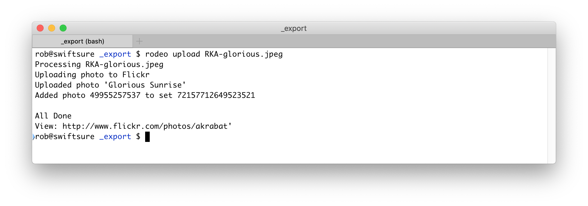

# Rodeo: Flickr Uploader

Rodeo uploads images to [Flickr][1], applying keyword based rules to add the image to albums and also to delete keywords that you may not want to be published.

It can also resize images for sharing on social media or in messages.

**Table of Contents:**

* [Usage](#usage)
* [Installation](#installation)
* [Config](#config)

[1]: https://flickr.com

## Usage

### rodeo upload

Upload files to Flickr, applying rules to either delete keywords or add to an album.

```
rodeo upload <files...>
```


### rodeo resize

Resize image within a bounding box at a given quality which can be useful for social media or messaging.

```
rodeo resize <files...>
```


### rodeo info

Displays useful metadata information about the files.

```
$ rodeo info <files...>
```


### Other commands

| Command | Purpose |
| --- | --- |
| `rodeo viewconfig` | Display Rodeo's configuration. |
| `rodeo authenticate` | Authenticate with Flickr. |
| `rodeo listalbums` | List albums (helpful to find album IDs. |


## Installation

You can download a binary from the [Releases page][releases] or you can build the source code.

To build the source code:

1. Clone this repository
2. Build rodeo: `go build`
3. Copy to a directory on your path: `mv rodeo /usr/local/bin` 
4. Run `rodeo --help` to check that it works

[releases]: https://github.com/akrabat/rodeo/releases

### Install dependencies

Rodeo requires a Flickr API key. To get this:

1. Go to [https://www.flickr.com/services/apps/create/apply][https://www.flickr.com/services/apps/create/apply]
2. Click "Apply for a Non-Commercial Key"
3. Enter these details:
    * Name: *Rodeo for {your name here}*
    * What are you building: *Command line Flickr uploader*
    * Check both check boxes if you acknowledge and agree to them
4. Press Submit
5. The *Key* and *Secret* are now displayed. Write these down.
6. Run `rodeo authenticate` to add your *Key* and *Secret* and to then authenticate with Flickr so that Rodeo has 
   access to your photos.

### Command line tools

Install [`exiftool`][2] and [`convert`][3] as Rodeo requires them. 

On macOS, these can be installed using [`brew`][4]. On Linux, use your distro's package manager.

[2]: https://exiftool.org
[3]: https://imagemagick.org/script/convert.php
[4]: https://brew.sh


 ## Config
 
 Rodeo's configuration is stored in `~/.config/rodeo.yaml`
 
 Example:
 
 ```yaml
 # location of command line tools
cmd: 
   convert: /usr/local/bin/convert
   exiftool: /usr/local/bin/exiftool

# Flickr configuration - use `rodeo authenticate` to set
flickr:
   api_key: "{api key}"
   api_secret: "{api secret}"
   full_name: "{full name}"
   oauth_token: "{auth token}"
   oauth_token_secret: "{auth token secret}"
   user_nsid: "{user's id}"
   username: "{user's name}"

# Configuration for `rodeo resize`
resize:
   method: "catrom"
   quality: "75"
   scale: "2000x2000"

# rules for `rodeo upload`
keywords:
   {keyword}: 
     delete: true
     album_id: "{album id}"
```

### Resize configuration

If these do not exist in `rodeo.yaml`, then they are added automatically on first
run of `rodeo resize`

| Property  | What it does                                                            |
| --------- | ----------------------------------------------------------------------- |
| `method`  | [Interpolation method][im]. Default is `catrom`                         |
| `quality` | [JPEG/PNG compression level][cl] of resized image in %. Default is `75` |
| `scale`   | Bounding dimensions of resized image in px. Default is `2000x2000`      |

[im]: https://imagemagick.org/script/command-line-options.php#interpolate
[cl]: https://imagemagick.org/script/command-line-options.php#quality

### Upload rules

For each keyword there are two actions:

| Action     | What it does                                                                         |
| ---------- | ------------------------------------------------------------------------------------ |
| `delete`   | When `true`, deletes the keyword from the file so that it does not exist on Flickr.  |
| `album_id` | Flickr ID of the album that this image will be added to.                             |


