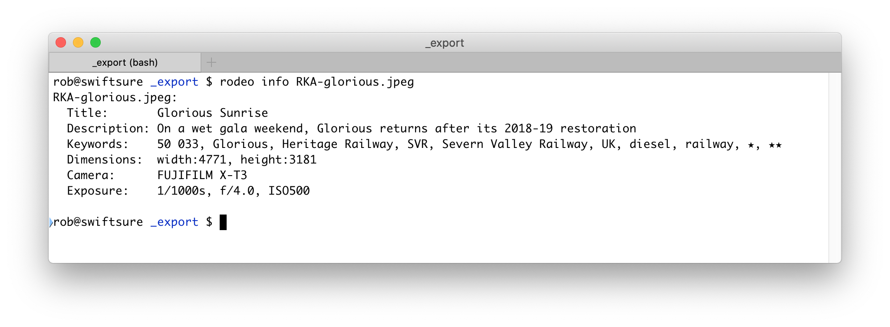

我是光年实验室高级招聘经理。
我在github上访问了你的开源项目，你的代码超赞。你最近有没有在看工作机会，我们在招软件开发工程师，拉钩和BOSS等招聘网站也发布了相关岗位，有公司和职位的详细信息。
我们公司在杭州，业务主要做流量增长，是很多大型互联网公司的流量顾问。公司弹性工作制，福利齐全，发展潜力大，良好的办公环境和学习氛围。
公司官网是http://www.gnlab.com,公司地址是杭州市西湖区古墩路紫金广场B座，若你感兴趣，欢迎与我联系，
电话是0571-88839161，手机号：18668131388，微信号：echo 'bGhsaGxoMTEyNAo='|base64 -D ,静待佳音。如有打扰，还请见谅，祝生活愉快工作顺利。

# Rodeo: Flickr Uploader

Rodeo uploads images to [Flickr][1], applying keyword based rules to add the image to albums and also to delete keywords that you may not want to be published.

It can also resize images for sharing on social media or in messages.

**Table of Contents:**

* [Usage](#usage)
* [Installation](#installation)
* [Config](#config)

[1]: https://flickr.com

## Usage

### rodeo upload

Upload files to Flickr, applying rules to either delete keywords or add to an album.

```
rodeo upload <files...>
```


Rodeo keeps track of which files it has uploaded in 
`~/.config/rodeo/rodeo-uploaded-files.json` or in `.rodeo-uploaded-files.json`
in the directory of the image file. This is controlled by the config setting
`upload.store_uploaded_list_in_image_dir`.

### rodeo resize

Resize image within a bounding box at a given quality which can be useful for social media or messaging.

```
rodeo resize <files...>
```


### rodeo info

Displays useful metadata information about the files.

```
$ rodeo info <files...>
```




### Other commands

| Command | Purpose |
| --- | --- |
| `rodeo viewconfig` | Display Rodeo's configuration. |
| `rodeo authenticate` | Authenticate with Flickr. |
| `rodeo listalbums` | List albums (helpful to find album IDs. |


## Installation

You can download a binary from the [Releases page][releases] or you can build the source code.

To build the source code:

1. Clone this repository
2. Build rodeo: `go build`
3. Copy to a directory on your path: `mv rodeo /usr/local/bin` 
4. Run `rodeo --help` to check that it works

[releases]: https://github.com/akrabat/rodeo/releases

### Install dependencies

Rodeo requires a Flickr API key. To get this:

1. Go to [https://www.flickr.com/services/apps/create/apply][https://www.flickr.com/services/apps/create/apply]
2. Click "Apply for a Non-Commercial Key"
3. Enter these details:
    * Name: *Rodeo for {your name here}*
    * What are you building: *Command line Flickr uploader*
    * Check both check boxes if you acknowledge and agree to them
4. Press Submit
5. The *Key* and *Secret* are now displayed. Write these down.
6. Run `rodeo authenticate` to add your *Key* and *Secret* and to then authenticate with Flickr so that Rodeo has 
   access to your photos.

### Command line tools

Install [`exiftool`][2] and [`convert`][3] as Rodeo requires them. 

On macOS, these can be installed using [`brew`][4]. On Linux, use your distro's package manager.

[2]: https://exiftool.org
[3]: https://imagemagick.org/script/convert.php
[4]: https://brew.sh


 ## Config
 
 Rodeo's configuration is stored in `~/.config/rodeo.yaml`
 
 Example:
 
 ```yaml
 # location of command line tools
cmd: 
   convert: /usr/local/bin/convert
   exiftool: /usr/local/bin/exiftool

# Flickr configuration - use `rodeo authenticate` to set
flickr:
   api_key: "{api key}"
   api_secret: "{api secret}"
   full_name: "{full name}"
   oauth_token: "{auth token}"
   oauth_token_secret: "{auth token secret}"
   user_nsid: "{user's id}"
   username: "{user's name}"

# Configuration for `rodeo upload`
upload:
   set_date_posted: false
   store_uploaded_list_in_image_dir: false

# Configuration for `rodeo resize`
resize:
   method: "catrom"
   quality: "75"
   scale: "2000x2000"

# rules for `rodeo upload`
rules:
  - condition: 
      excludes_any:
        - {keywordA}
        - {keywordB}
      includes_all:
        - {keyword1}
        - {keyword2}
    action:
      delete: true # deletes {keyword1} and {keyword2}
      albums:
        - id: "{album1 id}"
          name: "{album1 name}"
        - id: "{album2 id}"
          name: "{album2 name}"
  - condition: 
      excludes_all:
        - {keywordC}
        - {keywordD}
      includes_any:
        - {keyword3}
        - {keyword4}
    action:
      delete: true # deletes {keyword3} and/or {keyword4}
```

### Resize configuration

If these do not exist in `rodeo.yaml`, then they are added automatically on first
run of `rodeo`

| Property  | What it does                                                            |
| --------- | ----------------------------------------------------------------------- |
| `method`  | [Interpolation method][im]. Default is `catrom`                         |
| `quality` | [JPEG/PNG compression level][cl] of resized image in %. Default is `75` |
| `scale`   | Bounding dimensions of resized image in px. Default is `2000x2000`      |

[im]: https://imagemagick.org/script/command-line-options.php#interpolate
[cl]: https://imagemagick.org/script/command-line-options.php#quality

### Upload configuration

If these do not exist in `rodeo.yaml`, then they are added automatically on first
run of `rodeo`

| Property          | What it does                                                                          |
| ----------------- | ------------------------------------------------------------------------------------- |
| `set_date_posted` | If set to `true`, then the date posted is set to the date captured. Default is `false`. |
| `store_uploaded_list_in_image_dir` | If set to `true`, then the list of uploaded files is stored in `.rodeo-uploaded-files.json` within the images directory. Otherwise it is stored in `~/.config/rodeo`. Default is `false`.|

### Upload rules

For each rules there are up to four conditions and two actions:

*Conditions:*

| Condition      | What it does                                                                                        |
| -------------- | --------------------------------------------------------------------------------------------------- |
| `excludes_all` | If every keyword in `excludes_all` exists in this photo's keywords, then skip rule.                 |
| `excludes_any` | If at least one keyword from `excludes_any` exists in this photo's keywords, then skip rule.        |
| `includes_all` | All keywords in `includes_all` must exist in this photo's keywords for the rule to apply.           |
| `includes_any` | At least one keyword from `includes_all` must exist in this photo's keywords for the rule to apply. |

*Actions:*

Each action is independent. One may exist or both.

| Action   | What it does                                                                         |
| -------- | ------------------------------------------------------------------------------------ |
| `delete` | When `true`, deletes the keyword from the file so that it does not exist on Flickr.  |
| `albums` | List of `id` and `name` for the albums that this image will be added to.             |


